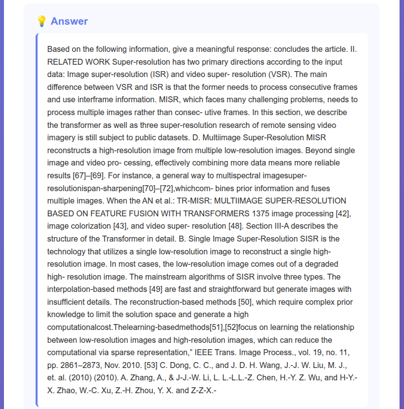
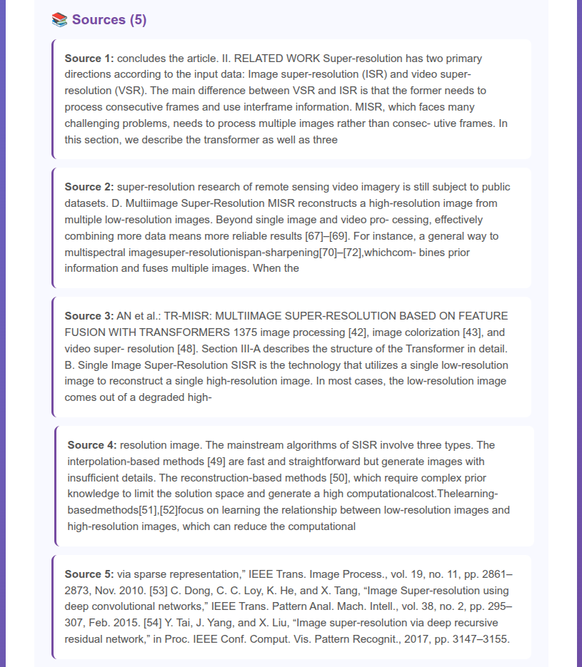

# Multimodal RAG App

A local Retrieval-Augmented Generation (RAG) application built in Python to ingest, embed, and query PDF and video files using ChromaDB, with a React web interface.
Built to explore RAG concepts and showcase skills in AI, backend, and forntend developmen.

## Demo


## Screenshots






## 🚀 Features

- 🔍 **Semantic Search**: Query documents with natural language using ChromaDB embeddings.
- 📄 **PDF Ingestion**: Extract and chunk text from PDFs.
- 🎥 **Video Transcription**: Transcribe MP4 videos with Faster-Whisper.
- 💾 **Local Vector Storage**: Store embeddings in ChromaDB.
- 🧠 **Local LLM**: Generate responses with DistilGPT-2.
- 🌐 **Web Interface**: Upload and query files via a React frontend.
- 📦 **Fully Local**: No external APIs for privacy and control.

## 🧱 Tech Stack

- **Python**: 3.10+
- **LangChain**: Document interface for ingestion
- **ChromaDB**: Local vector database (default embeddings, extensible to Sentence Transformers)
- **FFmpeg**: Audio extraction from videos
- **Faster-Whisper**: Local video transcription
- **FastAPI**: Backend API
- **DistilGPT-2**: Local text generation
- **React**: Frontend interface

## 📂 Project Structure

Based on https://github.com/mawaissaleem/multimodal_rag_app:

```
multimodal_rag_app/
├── backend/
│   ├── core/
│   │   ├── config/        # Configuration (e.g., Chroma collection)
│   │   ├── embedding/     # Embedding logic
│   │   └── ingestion/     # Ingestion pipeline
│   ├── services/
│   │   ├── embedding/     # ChromaDB integration
│   │   ├── ingestion/     # PDF/video processing
│   │   └── query/         # RAG query logic
│   └── api/
│       └── main.py        # FastAPI backend
├── frontend/              # React interface for uploads/queries
├── data/
│   ├── raw/               # Sample files (e.g., file01.pdf, video01.mp4)
│   └── uploads/           # User-uploaded files
├── db/                    # ChromaDB storage
├── tests/                 # Test scripts (e.g., test_ingestion.py)
├── requirements.txt       # Python dependencies
└── LICENSE                # MIT License
```

## 🛠️ Setup & Run

### 1. Clone the Repository

```bash
git clone https://github.com/mawaissaleem/multimodal_rag_app.git
cd multimodal_rag_app
```

### 2. Create a Virtual Environment

```bash
python -m venv .venv
source .venv/bin/activate  # On Windows: .venv\Scripts\activate
```

### 3. Install Dependencies

```bash
pip install -r requirements.txt
```

Install FFmpeg:

```bash
# Ubuntu/Debian
sudo apt install ffmpeg

# macOS (Homebrew)
brew install ffmpeg

# Windows (Chocolatey)
choco install ffmpeg
```

> **Note**: Run `ffmpeg -version` to verify. On Windows, download from https://ffmpeg.org/download.html if needed.

### 4. Run the Backend

```bash
uvicorn backend.api.main:app --reload
```

Backend runs at `http://127.0.0.1:8000`. API docs: `http://127.0.0.1:8000/docs`.

### 5. Run the Frontend

```bash
cd frontend
npm install
npm start
```

Frontend runs at `http://127.0.0.1:3000`.

## 📥 Ingesting Files

Place files in `data/uploads/` and ingest:

```python
from backend.core.ingestion import ingest_file

ingest_file("data/uploads/Evaluation Task.pdf", "pdf")
ingest_file("data/uploads/video01.mp4", "mp4")
```

> **Note**: PDFs are chunked, and videos are transcribed using Faster-Whisper. Embeddings are stored in `db/` using ChromaDB’s default embeddings.

## 🔍 Querying

Query via the `/query/query` endpoint:

```graphql
POST http://127.0.0.1:8000/query/query
Content-Type: application/json

{
  "question": "What are the evaluation criteria?",
  "filename": "Evaluation Task.pdf",
  "top_k": 5
}
```

**Example Response**:

```json
{
  "results": [
    "Evaluation criteria include accuracy, completeness, and relevance."
  ],
  "message": "Success"
}
```

> **Note**: `filename` is optional. DistilGPT-2 enhances responses post-retrieval.

## 🧪 Testing

Run `tests/test_ingestion.py` to verify:

```bash
python tests/test_ingestion.py
```

## 🐛 Troubleshooting

- **No documents found**:
  - Ensure files are in `data/uploads/`.
  - Run `test_ingestion.py` to check if query terms (e.g., "evaluation criteria") are in chunks.
  - Fix metadata in `backend/core/ingestion.py`:
    ```python
    metadata={"source": str(pdf_path), "filename": pdf_path.name, "chunk_id": idx}
    ```

- **ChromaDB query error**:
  - Update `ChromaManager.query` in `backend/services/embedding/chroma_manager.py`:
    ```python
    where_clause = {"filename": filename} if filename else None
    results = self.collection.query(query_texts=[query_text], n_results=n_results, where=where_clause)
    ```

- **PDF issues**: Scanned PDFs need OCR (install `tesseract-ocr`).
- **FFmpeg errors**: Verify `ffmpeg -version`.

## 🧩 Future Plans

- Integrate Sentence Transformers for better embeddings
- Support more LLMs (e.g., Mistral)
- Enhance frontend with upload progress
- Docker support

## 🤝 Feedback

This project explores RAG concepts. Feedback is welcome at https://github.com/mawaissaleem/multimodal_rag_app/issues!

## 📜 License

[MIT License](LICENSE)
